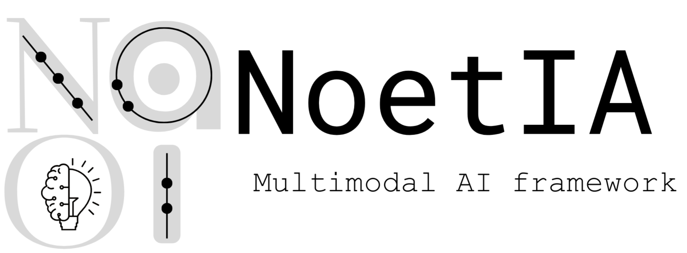
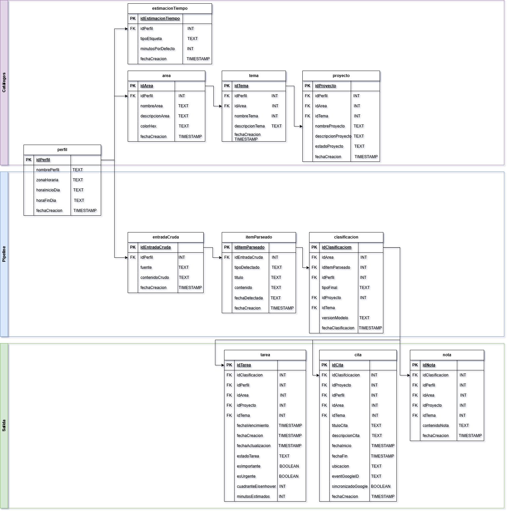

<p align="center">
  
</p>

<p align="center">
  <em>Multimodal AI framework for organizing unstructured information</em>
</p>

---

## ¿Qué es NoetIA?

**NoetIA** es un proyecto de ciencia de datos enfocado en la **organización inteligente de información no estructurada**, como ideas, tareas, notas y pensamientos escritos en texto libre.

Su objetivo es transformar entradas caóticas (brain dumps, listas desordenadas, notas rápidas) en una **estructura clara, lógica y accionable**, apoyándose en técnicas de *Natural Language Processing (NLP)* y modelos de lenguaje.

---

## Idea central

NoetIA parte de una premisa simple:

> El caos mental muchas veces no es falta de ideas, sino falta de estructura.

A partir de texto libre, el sistema busca clasificar la información dentro de una jerarquía conceptual como:

**Área → Tema → Proyecto → Tarea / Nota / Cita**

El proyecto está diseñado como un **framework modular**, enfocado en claridad, explicabilidad y buenas prácticas de ingeniería.

---

## Modelo de Datos

Vista general del modelo entidad–relación de NoetIA:



> Diagrama completo en versión interactiva:  
> [Ver ERD en HTML](assets/NoetIA-ERD.html)


(assets/screenshots/noetia_erd.html)

---

## Estructura del proyecto

```text
src/noetia/     → lógica principal del sistema
scripts/        → scripts ejecutables (sin notebooks)
app/            → demo en Streamlit
sql/            → esquemas y queries SQL
assets/         → identidad visual y recursos
data/           → datos locales (ignorado por Git)
