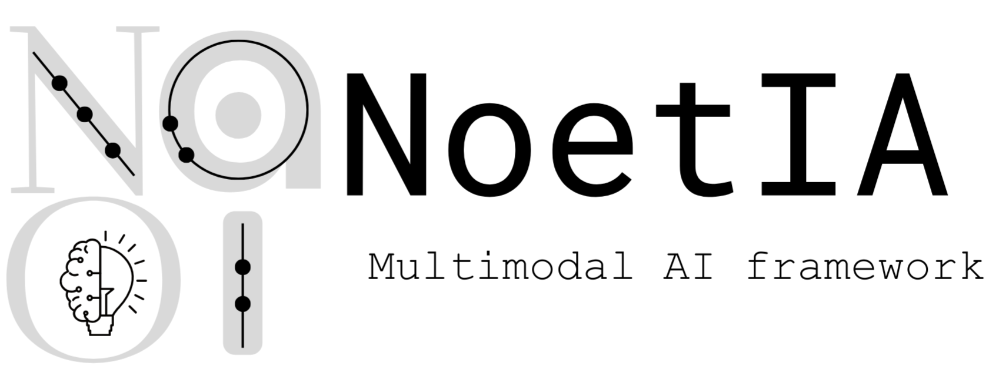

<p align="center">
  
</p>

<p align="center">
  <em>Intelligent Engine for Unstructured Information Organization</em>
</p>

---

## ¿Qué es NoetIA?

**NoetIA** es un framework de Inteligencia Artificial diseñado para organizar información no estructurada (ideas, tareas, notas y pensamientos). El sistema transforma entradas de texto libre en estructuras lógicas y accionables mediante pipelines de inferencia basados en Machine Learning.

---

## 🧠 Núcleo de Inferencia (Modelos)

El corazón de NoetIA reside en sus pipelines de procesamiento, diseñados para realizar inferencias rápidas y precisas sobre texto bruto:

### 1. Clasificador de Intención
Este modelo determina la naturaleza de la entrada (Nota, Tarea o Cita).
* **Técnica:** `Pipeline` de `scikit-learn` con `LinearSVC`.
* **Procesamiento:** Utiliza `TfidfVectorizer` (n-gramas 1-2) para capturar la relevancia semántica y `OneHotEncoder` para integrar metadatos temporales y contextuales.
* **Estado:** Optimizado mediante balanceo de clases (`class_weight='balanced'`) para garantizar equidad entre categorías.

### 2. Modelo de Priorización (Urgencia)
Determina la importancia de la actividad en una escala del 1 al 4.
* **Técnica:** `RandomForestClassifier`.
* **Procesamiento:** Evalúa relaciones no lineales entre la fecha, la existencia de lugares y el verbo principal de la acción.
* **Ventaja:** Al ser un modelo de ensamble de árboles, es excelente detectando contextos complejos (ej: "Fecha próxima" + "Verbo imperativo" = Prioridad alta).

---

## Modelo de Datos

La estructura se apoya en una jerarquía relacional escalable:

**Área → Tema → Proyecto → Actividad (con Intención y Prioridad)**


> [Ver ERD Interactivo](assets/NoetIA-ERD.html)

---

## Estructura del proyecto

```text
src/noetia/
├── models/         # Pipelines de ML serializados (.joblib)
├── nlp/            # Lógica de preprocesamiento y limpieza
├── engine/         # Orquestadores de inferencia
├── app/            # Demo en Streamlit
└── sql/            # Esquemas y queries SQLite